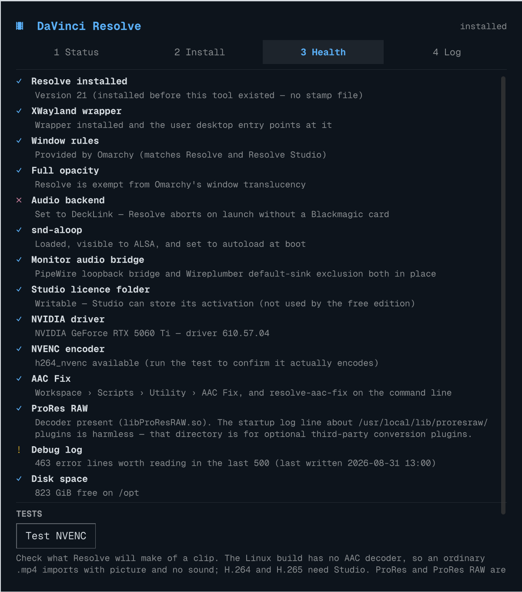

# omarchy-resolve

Install, repair and diagnose [DaVinci Resolve](https://www.blackmagicdesign.com/products/davinciresolve)
on [Omarchy](https://omarchy.com) (Arch Linux + Hyprland) — from a panel in the
shell, or from the terminal. NVIDIA, AMD and Intel GPUs are all handled: the
card in the machine decides which compute stack gets installed and what the
launcher sets up before Resolve starts.

Resolve is built for CentOS/RHEL and bundles its own copies of libraries that
Arch has moved on from. Getting it running means replacing some of those and
keeping others, repointing every RPATH in the tree, forcing XWayland, and
working around an ALSA quirk that otherwise makes renders hang with no error.
This does all of that, then keeps the checks around for when something goes
wrong later.



## Requirements

- **OS**: Omarchy 4 (Arch Linux). The panel needs omarchy-shell; the engine
  alone works on any Arch + Hyprland install.
- **GPU**: NVIDIA, AMD or Intel — see [Your GPU](#your-gpu). Resolve does all
  its work on the GPU, so this is the one requirement it will not run without.
- **Audio**: PipeWire + Wireplumber 0.5+ (Omarchy default) — the audio fix uses
  the SPA-JSON rule format introduced in 0.5.
- **Kernel**: any with `snd-aloop` available (`modinfo snd-aloop`).
- **Disk**: ~10 GB free wherever the ZIP lives, for temporary extraction.
- **The Resolve ZIP**: Blackmagic puts a form in front of the download, so you
  have to fetch it yourself. Save it to `~/Downloads/`.
- **Studio users**: nothing extra to do here — the licence folder permission
  that trips up a manual install is handled. See
  [Studio licensing](#studio-licensing) if you installed Resolve some other way.

## Install

### As a shell plugin

```bash
omarchy plugin add https://github.com/28allday/omarchy-resolve.git --enable
omarchy-shell shell toggle nosignal.davinci-resolve
```

`--enable` adds a bar icon. Leave it off if your bar is full — the panel is
still reachable by the toggle command above, or from a keybinding.

### As a command

```bash
git clone https://github.com/28allday/omarchy-resolve.git
cd omarchy-resolve
bin/omarchy-resolve install
```

Then launch Resolve from your app menu, from the panel, or with
`resolve-omarchy`.

## The panel

| Tab | What it is for |
|-----|----------------|
| **Status** | What is installed, which GPU Resolve will compute on and whether its stack is ready, which ZIP is waiting, whether a newer one has appeared. Launch Resolve from here. |
| **Install** | Pick the ZIP, set the options, install or uninstall. Live progress and a step list while it runs. |
| **Health** | The checks that explain Resolve misbehaving — audio backend, snd-aloop, window rules, opacity, the GPU and its compute stack, AAC Fix, log errors, disk space — plus a hardware-encoder test and a codec probe. |
| **Log** | The install log as it happens, or the tail of Resolve's own `ResolveDebug.txt`. |

Things worth knowing:

- **You are asked for your password once.** The work is split into a root half
  and a user half; only the root half is elevated, through `pkexec`, which
  Omarchy renders with its own themed authentication dialog — fingerprint
  included, if you have one enrolled.
- **Closing the panel does not stop the install.** The work belongs to the
  plugin's service, not the window. Reopen it whenever; the bar icon badges
  while it runs.
- **Dry run** rehearses the whole thing — same prompt, same progress — and
  writes nothing.
- **Uninstall never touches your Project Library.**

The panel can open straight to a tab, which makes a reasonable keybinding:

```bash
omarchy-shell nosignal.davinci-resolve show health
omarchy-shell nosignal.davinci-resolve show log
```

## The engine

The panel is a face on `bin/omarchy-resolve`, which stands on its own:

```bash
bin/omarchy-resolve check         # preflight as JSON: ZIP, GPU, versions, space
bin/omarchy-resolve install       # full install (asks for sudo)
bin/omarchy-resolve diagnose      # the Health tab's checks, as JSON
bin/omarchy-resolve probe <file>  # will Resolve read this clip?
bin/omarchy-resolve nvenc-test    # confirm NVENC actually encodes
bin/omarchy-resolve logs 200      # tail ResolveDebug.txt
bin/omarchy-resolve uninstall --phase root   # and --phase user
```

`--dry-run` prints what would happen without doing it. `--machine` adds
progress events for a GUI to parse; that is how the panel follows along.

### Why two phases

`--phase root` does the system work: packages, `/opt/resolve`, RPATH patching,
udev rules, the launcher, `snd-aloop`. `--phase user` does the session work:
Hyprland rules, the PipeWire bridge, your desktop entry, your Resolve config.

They are separate because a GUI has no terminal to answer a `sudo` prompt, so
the root half runs under a single `pkexec` — and under `pkexec`, `$HOME` is
root's. Running the user half elevated would write every one of those files
into `/root`, so the engine refuses to do it.

## What the install actually does

1. **Installs dependencies** one package at a time — `pacman` aborts the whole
   transaction if a single target is missing from the repos, which once took
   the entire install down when Arch dropped `gtk2`.
2. **Extracts** ZIP → `.run` → squashfs payload in a temp dir, cleaned up on
   exit however the run ends.
3. **Swaps glib for the system copies** (`libglib-2.0`, `libgio-2.0`,
   `libgmodule-2.0`) and **keeps the bundled `libc++`/`libc++abi`** — Resolve is
   compiled against a specific C++ ABI and replacing those crashes it on
   startup. The control-surface tarball unpacked in this step carries its own,
   older `libc++`, so it may only add libraries `libs/` does not already have;
   anything already there is Resolve's and wins.
4. **Repoints every RPATH** in the tree at `/opt/resolve`, including the ~200 MB
   Qt WebEngine library, which cannot be skipped for size because it links to
   other Resolve libraries. This is the slow part.
5. **Symlinks legacy `libcrypt.so.1`**, which Arch replaced with `.so.2`.
6. **Installs an XWayland wrapper** at `/usr/local/bin/resolve-omarchy`:
   Resolve has no native Wayland support, so it forces `QT_QPA_PLATFORM=xcb`,
   clears the Qt single-instance lockfiles a crash leaves behind, unsets the
   Kvantum/GTK Qt theme variables Omarchy sets globally (Resolve's bundled Qt
   has neither plugin), and runs Resolve from `/opt/resolve` so its rolling log
   lands in the install tree instead of wherever the launcher happened to be.
   The wrapper also carries the [GPU environment](#your-gpu), and works out
   which card to use when it runs rather than having one baked in at install
   time — so adding, removing or re-seating a card cannot leave it pinned to
   something that is no longer there.
7. **Makes the directories Resolve writes into inside the prefix writable.**
   Most of its support directories live under `~/.local/share/DaVinciResolve`
   and it creates those itself; a handful land in the root-owned install tree
   instead — `.license` for [Studio activation](#studio-licensing), plus
   `Apple Immersive`, `Extras`, `Fairlight` and `logs`. Resolve creates each at
   startup, and treats being denied `Apple Immersive` as fatal.
8. **Substitutes `RESOLVE_INSTALL_LOCATION`** in the four `.desktop` files
   Blackmagic ships. Their own installer does this; ours installs from the
   extracted AppImage, where nothing did. A `Path=` that does not resolve is
   fatal rather than cosmetic — the launcher refuses to start the application
   at all.
9. **Switches the audio backend from DeckLink to ALSA** — Resolve's shipped
   default aborts on first launch on any machine without a Blackmagic card.
10. **Sets up `snd-aloop`** and bridges it to your real output. See below.
11. **Installs Hyprland window rules** — only on an Omarchy old enough to need
    them; current versions ship these fixes themselves.
12. **Installs AAC Fix** — Resolve on Linux cannot decode AAC, so the install
    ends by putting the [AAC Fix](#a-clip-imports-with-picture-but-no-sound)
    script in Resolve's Scripts menu and a `resolve-aac-fix` command in
    `~/.local/bin`. Runs last, once Resolve's user folder exists.

### The `snd-aloop` business

Resolve opens raw ALSA hardware directly (`snd_pcm_open("hw:%d")`) and walks
every card looking for one it can own outright. When PipeWire holds them all,
that walk never settles: the render queue says "in progress", the ETA grows,
the encoder is never invoked, and nothing appears in the log. Traced with
`strace`, it is 14,000+ `SNDRV_CTL_IOCTL_PCM_INFO` and 47,000+
`/dev/snd/controlC*` calls after you press Render.

Loading the kernel's `snd-aloop` module gives Resolve a virtual card PipeWire
does not claim. It settles on that, and the render proceeds.

Two follow-on pieces come with it: a PipeWire loopback module bridging the
loopback's capture side to your default sink (otherwise monitoring is silent),
and a Wireplumber rule keeping the loopback out of the default-sink rotation
(otherwise it promotes itself the moment Resolve plays audio, and the bridge
feeds itself instead of your speakers).

Skip all of it with the panel toggle or `--no-aloop` if you have a dedicated
audio interface Resolve is happy with.

## Configuration

| Option | Panel toggle | Engine flag |
|--------|--------------|-------------|
| Full system upgrade first | — | `--full-upgrade` (refused on Omarchy, whose pacman hook blocks direct `-Syu` — run `omarchy update` first) |
| Skip the snd-aloop audio fix | Set up snd-aloop (off) | `--no-aloop` |
| Leave Hyprland alone | Manage Hyprland window rules (off) | `--no-hypr-rules` |
| Do not install AAC Fix | Install AAC Fix (off) | `--no-aac-fix` |
| Write the local window rules anyway | — | `--force-hypr-rules` |
| Change nothing, just report | Dry run | `--dry-run` |

**Cancel** on the Install tab stops a run. During the system phase that means
a second password prompt: the phase runs as root, and only root can stop it.
The engine finishes the command in flight, puts back anything it had set
aside (the Studio activation, for one) and exits; the install is then
incomplete, and running it again finishes it. A dismissed prompt leaves the
install running.

## Your GPU

Resolve renders, grades and plays back on the GPU; the CPU path is not a
fallback it can limp along on. What that needs differs by vendor, and getting
it wrong does not produce a slow Resolve — it produces one that exits at
startup with `Unsupported GPU Processing Mode` and no further explanation.

The install detects every card in the machine, picks the one Resolve should
use, and sets the rest up around that choice. The pick prefers a discrete card
over an integrated one, and reads the kernel to tell them apart — sysfs and
amdkfd's own topology, never lspci product names. A name does not say whether a
part is on the CPU package: AMD's Raphael iGPU is called "Raphael", matches
none of the usual integrated-graphics keywords, and on a name-based check beats
an RTX 5060 Ti sitting in the same box.

| Card | Compute | What the install adds |
|------|---------|------------------------|
| NVIDIA | CUDA | Nothing. CUDA comes with the driver, which Omarchy installs. |
| AMD | OpenCL via ROCm | ROCm 7.1.1 from the Arch Linux Archive, held there by an `IgnorePkg` line in `/etc/pacman.conf`, plus `ocl-icd`, `rocminfo`, `rocm-smi-lib` and `clinfo`. |
| Intel | OpenCL via NEO | `intel-compute-runtime`, `level-zero-loader`, `ocl-icd`, `vulkan-intel`, `intel-media-driver`, `clinfo`. |

`bin/omarchy-resolve gpu` prints the whole picture as JSON — every card, which
one was picked, its gfx target on AMD, and whether the compute stack behind it
is ready. It changes nothing and needs no root, so it is the thing to run on a
machine before trusting an install to it.

### AMD: why the ROCm version is pinned

ROCm 7.2.0 broke DaVinci Resolve on every AMD GPU — `clCreateContext` fails
outright, or Resolve hangs on the Color page
([ROCm#5982](https://github.com/ROCm/ROCm/issues/5982)). 7.1.1 is the last
release confirmed working everywhere, so that is what gets installed, and an
`IgnorePkg` line keeps a routine `pacman -Syu` from quietly undoing it weeks
later. Uninstall lifts the hold again — and only the line this installer
wrote, which it marks with a comment for exactly that reason.

AMD did fix the launch crash in 7.2.1, and Arch has carried 7.2.4 since May
2026. The pin stays the default anyway: Arch's own 7.2.2 build was still being
reported broken after that fix, and nobody has retested 7.2.4 against Resolve.
To try it yourself, remove the `IgnorePkg` line, `pacman -Syu`, and exercise
the Color, Edit and Media pages plus a short render before believing it.

The launcher pins OpenGL and Vulkan to the chosen card by PCI address —
`DRI_PRIME=pci-0000_BB_DD_F`. It never uses `DRI_PRIME=1`, and neither should
you: that means "the *other* card relative to Mesa's default", so on a machine
whose monitor is already on the Radeon it flips OpenGL to the integrated GPU
while OpenCL stays on the Radeon. CL/GL interop then fails and Resolve hangs on
Color — the same symptom as the ROCm bug, from an unrelated cause.
`switcherooctl` is avoided for the same reason: internally it is `DRI_PRIME=1`.

### Intel: experimental

Blackmagic does not support Intel GPUs on Linux. With `intel-compute-runtime`
installed the Arc appears as an OpenCL device and editing, playback and
transcode generally work, but the Neural Engine, some effects, Fairlight FX and
noise reduction may fall back to the CPU or fail. The install sets it up
properly and says so on the Install tab; it cannot make it supported.

The launcher pins by PCI address through `ZE_AFFINITY_MASK` rather than a NEO
device index, because NEO's numbering is not a function of PCI order. On a
discrete Battlemage card it also sets `NEOReadDebugKeys=1` and
`OverrideGpuAddressSpace=48`, which that silicon needs and the Panther Lake
Xe3 iGPUs — confusingly sold under the same "Arc B-series" name — do not.

### Overriding the choice

Two environment variables, read by the launcher every time it runs:

```bash
RESOLVE_GPU_BDF=0000:03:00.0 davinci-resolve   # use this card, whatever the pick says
RESOLVE_NO_PIN=1 davinci-resolve               # set no GPU variables at all
```

Set them permanently in an override file (below). `bin/omarchy-resolve gpu`
lists the PCI addresses to choose from.

### Hybrid GPU laptops (Optimus)

An AMD or Intel pick is pinned to its PCI address automatically, so this
section is about the NVIDIA case: a laptop that displays through its iGPU and
wants Resolve on the NVIDIA card needs PRIME offload, which is not set by
default because forcing it on a desktop whose monitor is already on the NVIDIA
card makes things worse.

Do not edit `/usr/local/bin/resolve-omarchy` directly. Every install and
update writes that file from scratch, so changes made in it are reverted the
next time you update Resolve — silently, and the machine quietly goes back to
the wrong GPU. Put them in an override file instead. No install touches either, and the
wrapper reads them twice: before choosing a GPU, so `RESOLVE_GPU_BDF` and
`RESOLVE_NO_PIN` in them steer the choice, and again immediately before
launching, so anything they export outright wins over what the choice set:

```bash
mkdir -p ~/.config/omarchy-resolve
cat > ~/.config/omarchy-resolve/wrapper.env <<'EOF'
export __NV_PRIME_RENDER_OFFLOAD=1
export __GLX_VENDOR_LIBRARY_NAME=nvidia
EOF
```

`/etc/omarchy-resolve/wrapper.env` does the same for every user on the machine.
It is read first, so a user's own file wins where both set the same variable.
Anything else Resolve should launch with goes here too.

## Troubleshooting

### Studio licensing

**If you are running DaVinci Resolve Studio, `/opt/resolve/.license` must be
writable by the user running Resolve.** The install creates it as root, so on a
manual install it ends up read-only, Resolve Studio cannot store its
activation, and licensing fails — with nothing in the interface explaining
why. It looks like a bad dongle or a rejected key.

This installer sets the permission for you. If you installed Resolve some other
way, or you are fixing an existing install:

```bash
sudo chmod 7777 /opt/resolve/.license
```

The Health tab checks this, and says so plainly if the folder is missing or
not writable. The free edition never writes here, so the permission is
harmless either way.

### A clip imports with picture but no sound

**The Linux build of Resolve has no AAC decoder** — free and Studio alike. An
ordinary camera or phone `.mp4`/`.mov` carries AAC, so it lands on the timeline
silent with nothing in the UI to explain it. The fix is to rewrap the file:
the picture is copied untouched, only the audio is decoded once to PCM.

The install puts **AAC Fix** in place to do exactly that. Inside Resolve, open
a project and go to *Workspace › Scripts › Utility › AAC Fix*: **Scan Media
Pool** lists every AAC clip, **Fix Selected** / **Fix All** convert them and
relink the clips in place so timelines keep working, and **Import for
Resolve…** converts a file or folder on the way in. Resolve only reads its
Scripts folder at startup, so restart it after the install.

From the terminal:

```bash
resolve-aac-fix scan ~/Footage          # list the AAC files (recursive)
resolve-aac-fix fix clip.mp4            # -> clip_pcm.mov, ready to import
resolve-aac-fix probe clip.mp4          # what is in this file?
```

Converted files are written as `<name>_pcm.mov` next to the source (or `--out
DIR`), grow by roughly 8 MB per minute of stereo, and the original is never
touched. It is the same as running this by hand:

```bash
ffmpeg -i input.mp4 -c:v copy -c:a pcm_s24le output.mov
```

Two neighbouring facts, since they get confused:

- **H.264 and H.265 decode need Resolve Studio on Linux.** The free edition
  cannot read them.
- **ProRes and ProRes RAW are supported.** Resolve ships its own decoder
  (`/opt/resolve/libs/libProResRAW.so`) and loads a bundled conversion plugin at
  startup. The `ProRes RAW SDK raw conversion plug-in loading error(s): unable
  to open default plug-in directory /usr/local/lib/proresraw/plugins` line in
  the log is **harmless** — that directory is for optional third-party plugins
  and its absence is the normal state.

`bin/omarchy-resolve probe <file>`, or the Health tab, tells you which codecs a
clip uses and whether Resolve will read them.

### The render queue runs forever and produces nothing

Check `snd-aloop` is loaded:

```bash
lsmod | grep snd_aloop
sudo modprobe snd-aloop                                    # if absent
echo 'snd-aloop' | sudo tee /etc/modules-load.d/snd-aloop.conf
```

If it is loaded and renders still hang, check the clip with
`bin/omarchy-resolve probe`.

### The default sink keeps flipping to "Loopback"

The Wireplumber exclusion rule is missing or not in effect:

```bash
cat ~/.config/wireplumber/wireplumber.conf.d/51-resolve-aloop-no-default.conf
systemctl --user restart wireplumber pipewire pipewire-pulse
```

### Resolve will not start

```bash
setsid /usr/local/bin/resolve-omarchy >/tmp/resolve-stderr.log 2>&1 &
bin/omarchy-resolve logs 200
```

`Cannot open display` means the XWayland wrapper is being bypassed — launch via
`resolve-omarchy`, not `/opt/resolve/bin/resolve`. "Single instance already
running" after a crash is a stale Qt lockfile; the wrapper clears those, so
launching through it again is the fix.

Two failures look identical from the app menu — no window, no error, nothing in
`ResolveDebug.txt`, because Resolve dies before the log is opened. Both were
bugs in this installer, fixed in current versions; if you are on an install made
by an older one, run the install again to repair it.

```
symbol lookup error: /opt/resolve/bin/resolve:
undefined symbol: _ZNSt3__117bad_function_callD1Ev
```

The control-surface tarball's older `libc++` was unpacked over Resolve's own.
`/opt/resolve/libs/libc++.so.1` should be a symlink to `libc++.so.1.0`; if it is
a regular file, that is the fault.

```
Failed to create application support directories
```

Resolve could not create one of the directories it wants inside `/opt/resolve`
— it makes them `0777` at startup, and the install tree is root-owned. Resolve
names the directory in its own log:

```bash
grep "mkdir failed for directory" ~/.local/share/DaVinciResolve/logs/ResolveDebug.txt
```

### The bar covers Resolve's menu bar, or a dialog traps the pointer

Current Omarchy fixes both itself. On an older one, the engine installs the
rules; run `bin/omarchy-resolve diagnose` to see which copy is in force.

### Missing library errors

Usually a partial install. Re-run the install — it is safe to repeat, and the
RPATH pass skips files already correct.

## What gets installed

| Path | What |
|------|------|
| `/opt/resolve` | The application |
| `/opt/resolve/.omarchy-resolve.json` | Which version, from which ZIP, when |
| `/opt/resolve/.license` | Studio activation — made writable, or Studio licensing fails |
| `/opt/resolve/{Apple Immersive,Extras,Fairlight,logs}` | Directories Resolve creates at startup — made writable; denied `Apple Immersive` it will not launch at all |
| `/usr/local/bin/resolve-omarchy` | XWayland wrapper (the real launcher) |
| `/usr/bin/davinci-resolve` | Convenience shim to the wrapper |
| `/usr/share/applications/*.desktop`, `/usr/share/icons/hicolor/**` | Menu entries and icons |
| `/usr/lib/udev/rules.d/99-*.rules` | Blackmagic panels, keyboards, capture cards |
| `/etc/modules-load.d/snd-aloop.conf` | Loads the virtual audio card at boot |
| `/etc/pacman.conf` | On AMD only: one `IgnorePkg` line holding ROCm at 7.1.1, marked with a comment so uninstall removes only ours |
| `/etc/pki/tls` | Symlink to `/etc/ssl`, for Resolve's CentOS-path certificate lookup |
| `~/.local/share/applications/davinci-resolve-wrapper.desktop` | User entry, outranks the system one |
| `~/.config/pipewire/pipewire.conf.d/50-resolve-aloop-bridge.conf` | Monitor audio bridge |
| `~/.config/wireplumber/wireplumber.conf.d/51-resolve-aloop-no-default.conf` | Keeps the loopback out of the default-sink rotation |
| `~/.config/hypr/davinci-resolve.lua` | Window rules, only on an Omarchy that needs them |
| `~/.local/share/DaVinciResolve/Fusion/Scripts/Utility/AAC Fix.py` | AAC Fix, in Resolve's Scripts menu |
| `~/.local/bin/resolve-aac-fix` | The same script as a command (symlink to the above) |

Your projects and settings live in `~/.local/share/DaVinciResolve` and are never
touched by an install, a reinstall, or an uninstall.

## Updating Resolve

Blackmagic put a form in front of their downloads, so nothing can fetch a new
release for you. Once the ZIP is in `~/Downloads/`, though, the rest is handled:

1. Download the new version to `~/Downloads/`.
2. Open the panel. The Status tab compares the ZIP against what you are running
   and says **"Update waiting: 21.0 is newer than 21.0b2"**.
3. Press **Reinstall** (or pick a specific ZIP first on the Install tab).

Or from the terminal — the newest ZIP is picked automatically:

```bash
bin/omarchy-resolve install
```

An update is a full reinstall: `/opt/resolve` is replaced wholesale, which is
how Blackmagic ship it anyway. What survives untouched:

- `~/.local/share/DaVinciResolve` — your Project Library, settings, layouts,
  keyboard mappings and the LUTs you have imported into your user folder.
- `/opt/resolve/.license` — the Studio activation. It is set aside before the
  old tree is removed and put back over the new one, so an update does not
  end in the licence dialog.
- Your Hyprland rules, PipeWire bridge and desktop entries, which are rewritten
  identically rather than lost.

What does not survive, because it lives inside `/opt/resolve`: anything you
dropped into the install tree yourself — OFX plugins installed to
`/opt/resolve/OFX`, custom LUTs placed under `/opt/resolve/LUT`, Fusion
templates. Copy those out first if you have any.

### How "newer" is decided

Every install through this tool records what it installed in
`/opt/resolve/.omarchy-resolve.json`, and the ZIP filename carries the version,
so the two are compared directly. Beta ordering is handled: `21.0b2` is newer
than `21.0b1`, and `21.0` is newer than either.

Two honest limits:

- **An install that predates this tool has no record**, so there is nothing
  exact to compare against. Resolve's own docs give only the major version
  ("21"), which is enough to spot a whole new major release but not a point
  release — so within a major it says nothing rather than guessing. The first
  install through the panel fixes this permanently.
- **The ZIP offered is the newest by modification time**, matching what the
  installer has always picked. If that turns out to be an older build than the
  one you are running, it says so and calls it a downgrade instead of an
  update. The Install tab lists every ZIP you have, so you can pick another.

## Uninstalling

Press **Uninstall** on the panel's Install tab, or:

```bash
sudo bin/omarchy-resolve uninstall --phase root
bin/omarchy-resolve uninstall --phase user
```

Add `--purge-data` to the user phase to delete `~/.local/share/DaVinciResolve`
as well, including the Project Library. That is not reversible.

Uninstalling removes `/opt/resolve/.license` with the rest of the tree. On
Studio, deactivate the licence from inside Resolve first if you want to use
the key on another machine.

To remove the plugin itself: `omarchy plugin remove nosignal.davinci-resolve`.

## Related

The original terminal-only installer this grew out of lives at
[DaVinci-Resolve-Omarchy](https://github.com/28allday/DaVinci-Resolve-Omarchy).
Its AMD and Intel siblings —
[DaVinci-Resolve-AMD-Omarchy](https://github.com/28allday/DaVinci-Resolve-AMD-Omarchy)
and `intel_resolve` — are where the ROCm pinning, the `DRI_PRIME` PCI-tag fix
and the Arc handling were worked out. All three are now folded into this
engine, so it is the one to use; they remain useful as the written record of
why each of those decisions is what it is.

DaVinci Resolve is a product of Blackmagic Design. This project is not
affiliated with or endorsed by them.

## License

MIT
